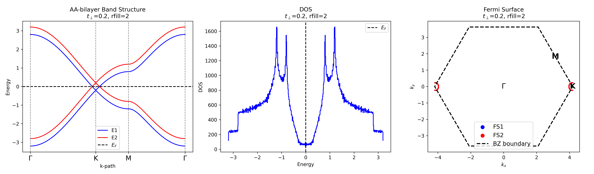

タイトル: AA 二層ハニカム格子のバンド・DOS・フェルミ面（解析スクリプトの説明）

このページではリポジトリ内のスクリプト `band_template.py` の先頭から「図を出力するところ」までを抜粋し，何をしようとしているのかを解説します．さらに，出力される図の内容と，既存の多くのFLEX系コードが持つ「逆格子ベクトルの倍数でしか k 情報を保持していない」ことが原因で生じる実務上の不都合について，分かりやすく説明します．

1) スクリプトの目的（概要）
- 単純ハニカム系（AA バイレイヤー）の簡易バンドモデルを作り，
	- 高対称点経路（Γ→K→M→Γ）に沿ったバンド分散（バンド図），
	- 全 k 空間での状態密度（DOS），
	- フィルされたブリルアンゾーン内でのフェルミ面プロット
	を一枚の図（3 パネル）として出力することを目的としています．

2) band_template.py の区切りの良いポイント（このページで説明する範囲）
- パラメータ定義（格子定数 a, ホッピング t, 層間 t_perp, フィルレベル rfill など）
- 高対称点経路の生成（Γ, K, M, Γ とその間点を密に分割）
- 経路上のバンド分散の計算（サイト間ホッピングから |f(k)| を計算し，± のバンドを構成）
- 全 k 空間グリッドを作り，六角形の第一ブリルアンゾーン内のみを選択して各点のバンドエネルギーを計算
- DOS の計算（全バンドを統合してヒストグラム化）とフェルミエネルギー決定（充填率 rfill に基づく）
- フェルミ面マスク作成と，最後に 3 パネル（band / DOS / FS）を描画し PNG に保存する箇所

以下では上記それぞれの要所を簡潔に説明します．

3) 主要処理の説明（技術的解説）
- f_k(kx,ky) の定義:
	lattice の隣接ベクトル δ_i を使って
	$$f(\mathbf{k})=\sum_{i=1}^3 e^{i\mathbf{k}\cdot\delta_i}$$
	を評価し，エネルギーは $\pm t|f(\mathbf{k})|$（単層ハニカム）に層間項 $t_\perp$ を足し合わせることで AA バイレイヤーの 4 バンドを作っています．

- 高対称点経路と x 軸位置:
	点列を密にサンプリングしてパス上の k 座標列を作り，隣接点間のユークリッド距離を累積することで横軸（k-path の距離）を作成します．これによりバンド図の横軸が「実空間に対応した距離（カートesian）」になります．

- 六角形BZのフィルタリング:
	2 次元格子のブリルアンゾーン（正六角形）内に入る k 点だけを選択するための条件式
	(|kx|/√3 + |ky| < kx_max) のような単純な不等式で BZ をマスクしています（スクリプトではこれを用いて BZ 内点のみを集めています）．

- DOS と Ef の決定:
	全バンドのエネルギーをまとめてヒストグラム化し，充填率 rfill に対応する状態数に相当する位置を Fermi エネルギーとして選んでいます．

4) 出力される図（説明）
- 図は横に 3 パネル：
	(a) バンド図（Γ→K→M→Γ）: 4 バンドを色分け，破線で Fermi エネルギーを表示
	(b) DOS: ヒストグラム表示と Fermi エネルギーの破線
	(c) フェルミ面: BZ 内の k 点のうちエネルギーが Ef に近い点をプロットし，複数バンド（色分け）を示す．
- 保存ファイル名の例: `tp{tperp}_fill{rfill}_AA_honeycomb_band_dos_fs.png`（スクリプトの末尾で保存）

5) 実務上の注意点 — FLEX 系コードとの接続で生じる問題点
以下は今回ユーザーが特に強調したい点（FLEX コードの k 表記に関する注意）です．

- 多くの格子多体系数値コード（FLEX 実装を含む）は k 点を "逆格子ベクトルの倍数"（fractional coordinates）でしか内部的に持たない実装になっています．具体的には k = (n1/N1) b1 + (n2/N2) b2 のように 2つ（あるいは 3つ）の整数インデックスで表されます．これは格子周期性を満たすには自然で効率的ですが，次のような落とし穴があります：

	- 逆格子基底ベクトル b1, b2 は直交しているとは限らない（六角格子では直交しない）．つまり "(k1,k2) のユークリッド距離" をそのまま kx,ky に見なしてプロットすると幾何学的に歪んだプロットになる．
	- 高対称点（Γ,K,M）などを Cartesian 座標に正しく変換するためには，必ず k_cart = k1*b1 + k2*b2 を実行してから，ユークリッド距離や内積を計算する必要がある．

- 具体例（六角格子）:
	基底格子ベクトルを
	$$\mathbf{a}_1 = a(1,0),\quad \mathbf{a}_2 = a(1/2,\sqrt{3}/2)$$
	とすると，対応する逆格子ベクトルは
	$$\mathbf{b}_1 = \frac{2\pi}{a}\,(1,-1/\sqrt{3}),\quad \mathbf{b}_2 = \frac{2\pi}{a}\,(0,2/\sqrt{3}).$$
	FLEX で得た (k1,k2) をそのまま (kx,ky)=(k1,k2) と扱うと，これらを用いた正しい座標系とは一致しません．必ず上の線形変換を行ってください．

- 結果として生じる不都合:
	1. 高対称点間の距離（Γ→K 等）が歪み，バンド図の横軸が実際の波数距離と一致しない．
	2. フェルミ面を描く際，格子内マスク（BZ 内判定）や対称性操作が誤って適用され，見かけ上の FS 形状が歪む．
	3. 多基底・多原子系でブリルアンゾーンが非直交基底で表現される場合，DOS の分配や k-重み付けの扱いを誤ると物理量がずれる．

6) 実践的な対処法（推奨ワークフロー）
- FLEX 等の出力が "格子内座標（n1/N1,n2/N2）" 形式ならば，プロットや距離計算の前に必ず

	$$\mathbf{k}_{\mathrm{cart}} = \frac{n_1}{N_1}\,\mathbf{b}_1 + \frac{n_2}{N_2}\,\mathbf{b}_2$$

	に変換すること．
- Cartesian に変換した後で，今回の `band_template.py` のように高対称点経路を Cartesian で生成し，ユークリッド距離に基づく横軸を作ると，バンド図が物理的に正しい比率で表示されます．
- フェルミ面描画では，格子点の座標系が Cartesian になっていることを確認し，必要に応じて BZ のポリゴン判定（凸包やクラスタリング）で内点フィルタを行うと良いです．

7) まとめ（ユーザーが伝えたいポイントの言い回し案）
- 「FLEX などの k-space 情報は（b1,b2 の整数倍）という格子内座標で与えられることが多く，そのままプロットすると逆格子基底の非直交性のためにバンド図やフェルミ面が幾何学的に歪む．実物質に合わせるには逆格子ベクトルで表された座標を Cartesian に変換し，距離や角度を正しく評価する工程が必須である」

---

付録: `band_template.py` で出力される図の説明（例）
- 左: Γ→K→M→Γ に沿ったバンド分散（青=lower pair, 赤=upper pair）。中央: DOS（状態密度）と E_F（破線）。右: フェルミ面（BZ 境界点・高対称点を注記）．
- 保存ファイル名: `tp{tperp}_fill{rfill}_AA_honeycomb_band_dos_fs.png`（スクリプトの文字列埋め込みで決定）

必要ならこのページで `band_template.py` の主要関数（f_k, BZ マスク, k-path 生成等）をコードブロックでそのまま転載しても良いです．転載する場合はどこまで載せるか指示してください．

以下ではスクリプトを小さなブロックに分解して、各ブロックごとに「コード」→「何をしているか」を解説します。最後に実行結果の図を載せます。

### 1) パラメータ定義
コード:
```python
import numpy as np
import matplotlib.pyplot as plt

# 基本パラメータ
a = 1.0
t = 1.0
# テンプレートでは {tperp} / {rfill} になっていますが、実行時は数値を埋めます
tperp = 0.2
density = 100    # 高対称点経路の細かさ
Nk = 300         # k-grid 解像度（1方向）
N_DOS = 500      # DOS ヒストグラムの箱数
rfill = 2        # フィリング（例）

# 第一BZ の大きさ（六角格子に合わせた目安）
kx_max = 4 * np.pi / (3 * a)
ky_max = 2 * np.pi / (a * np.sqrt(3))
```

解説:
- ここでモデル全体の数値的な解像度と物理パラメータ（格子定数 a, 近接ホッピング t, 層間 t_perp）を定義します。
- `density` は高対称点経路の分割密度、`Nk` は全BZの格子解像度に対応します。`rfill` は便宜上 "filled bands" の数（ここでは 2）を示す例です。

---

### 2) 高対称点経路の生成（Γ→K→M→Γ）
コード:
```python
Gamma = np.array([0.0, 0.0])
K = np.array([kx_max, 0.0])
K2 = np.array([kx_max * np.cos(np.pi/3), kx_max * np.sin(np.pi/3)])
M = (K + K2) / 2
points = [Gamma, K, M, Gamma]
labels = ["$\\Gamma$", "K", "M", "$\\Gamma$"]

# パス上の点を密にサンプリングし，隣接点間のユークリッド距離を累積して横軸を作る
k_path = [points[0]]
tick_positions = [0]
x_axis = [0.0]
for i in range(len(points) - 1):
	start = points[i]
	end = points[i+1]
	for j in range(density):
		frac = (j+1) / density
		k_now = start + frac * (end - start)
		k_path.append(k_now)
		if len(k_path) > 1:
			dist = np.linalg.norm(k_path[-1] - k_path[-2])
			x_axis.append(x_axis[-1] + dist)
	tick_positions.append(x_axis[-1])
k_path = np.array(k_path)
x_axis = np.array(x_axis)
```

解説:
- 高対称点列を線形補間して経路上の k 点を作ります。
- 横軸は補間点間のユークリッド距離を累積したものなので、プロットの横軸が実空間（波数空間の距離）に対応します。

---

### 3) 単層ハニカムの構成因子 f(k) と経路上のバンド計算
コード:
```python
def f_k(kx, ky):
	delta = np.array([
		[0, a/np.sqrt(3)],
		[-a/2, -a/(2*np.sqrt(3))],
		[a/2, -a/(2*np.sqrt(3))]
	])
	return sum(np.exp(1j * (kx*d[0] + ky*d[1])) for d in delta)

E_plus1, E_plus2, E_minus1, E_minus2 = [], [], [], []
for k in k_path:
	fk = f_k(k[0], k[1])
	e = t * np.abs(fk)
	# AA 二層では層間 t_perp により ± シフトして 4 バンドに
	E_plus2.append(e + tperp)
	E_plus1.append(e - tperp)
	E_minus2.append(-e + tperp)
	E_minus1.append(-e - tperp)
E_plus2 = np.array(E_plus2)
E_plus1 = np.array(E_plus1)
E_minus2 = np.array(E_minus2)
E_minus1 = np.array(E_minus1)
```

解説:
- ハニカムの1層分は f(k) の絶対値に比例した ± バンドを持ちます。
- AA 二層モデルでは層間ホッピング t_perp によって各バンドが上または下にずれ、合計で 4 バンドとなります。

---

### 4) 全 k グリッドでの計算と六角形 BZ のマスク
コード:
```python
kx = np.linspace(-kx_max, kx_max, Nk)
ky = np.linspace(-ky_max, ky_max, Nk)
KX, KY = np.meshgrid(kx, ky, indexing='ij')

E1, E2, E3, E4 = [], [], [], []
mask_list = []
for i in range(Nk):
	for j in range(Nk):
		# 六角形BZ内のみを簡易条件でマスク
		if (np.abs(KX[i,j]) / np.sqrt(3) + np.abs(KY[i,j]) < kx_max):
			fk = f_k(KX[i,j], KY[i,j])
			e = t * np.abs(fk)
			E2.append(e + tperp)
			E1.append(e - tperp)
			E4.append(-e + tperp)
			E3.append(-e - tperp)
			mask_list.append((i, j))

E1 = np.array(E1)
E2 = np.array(E2)
E3 = np.array(E3)
E4 = np.array(E4)
```

解説:
- 実際のフェルミ面描画や DOS は全 k 空間上で評価する必要があります。
- ただし六角形の第一BZ外の点は無視するので、簡易条件で BZ をマスクしています（FLEX 等の出力を使う場合は座標変換が必須）。

---

### 5) DOS と Fermi エネルギーの決定
コード:
```python
all_E = np.concatenate([E1, E2, E3, E4])
e_min, e_max = all_E.min(), all_E.max()
de = (e_max - e_min) / N_DOS
dos = np.zeros(N_DOS + 1, dtype=int)
for e in all_E:
	k = int(np.round((e - e_min) / de))
	if 0 <= k <= N_DOS:
		dos[k] += 1

# 単純な充填から Ef を決める（例）
Nk_total = len(E1)
band_num = 4
N_state = Nk_total * band_num
n_filled = int((rfill / band_num) * N_state)
energy_sorted = np.sort(all_E)
ef = energy_sorted[n_filled]
```

解説:
- 全バンドのエネルギーをヒストグラム化して DOS を作り、与えられた充填から単純に Fermi エネルギーを取り出しています。
- 実案件では k 点の重みづけや格子対称性を反映させる必要がありますが、ここでは教育的に単純化しています。

---

### 6) フェルミ面のマスク作成
コード:
```python
FS1 = np.abs(E1 - ef) < de
FS2 = np.abs(E2 - ef) < de
FS3 = np.abs(E3 - ef) < de
FS4 = np.abs(E4 - ef) < de


ky_FS = np.array([KY[i,j] for (i,j) in mask_list])
```

解説:
- Ef に近い点を閾値 `de` で拾ってフェルミ面点群を作ります。プロットではバンドごとに色を分けて散布します。

---

### 7) プロット（band / DOS / FS）と保存
コード:
```python
fig, axs = plt.subplots(1, 3, figsize=(17, 5))

# バンド図（横軸は累積距離）
axs[0].plot(x_axis, E_plus1, color="b", label="E1")
axs[0].plot(x_axis, E_minus1, color="b")
axs[0].plot(x_axis, E_plus2, color="r", label="E2")
axs[0].plot(x_axis, E_minus2, color="r")
axs[0].axhline(ef, color='black', linestyle='--', label="$E_F$")
for pos in tick_positions:
	axs[0].axvline(pos, color='gray', linestyle='--', linewidth=1)
axs[0].set_xticks(tick_positions, labels, fontsize=14)
axs[0].set_ylabel("Energy")
axs[0].set_xlabel("k-path")
axs[0].set_title("AA-bilayer Band Structure\n$t_\\perp$={tperp}, rfill={rfill}".format(tperp=tperp, rfill=rfill))
axs[0].legend()

# DOS
energies_dos = np.linspace(e_min, e_max, N_DOS+1)
axs[1].plot(energies_dos, dos, drawstyle='steps-mid', color='blue')
axs[1].axvline(ef, color="black", linestyle="--", label="$E_F$")
axs[1].set_xlabel("Energy")
axs[1].set_ylabel("DOS")
axs[1].set_title("DOS\n$t_\\perp$={tperp}, rfill={rfill}".format(tperp=tperp, rfill=rfill))
axs[1].legend()

# フェルミ面
axs[2].scatter(kx_FS[FS1], ky_FS[FS1], color='b', s=2, label='FS1')
axs[2].scatter(kx_FS[FS2], ky_FS[FS2], color='r', s=2, label='FS2')
axs[2].scatter(kx_FS[FS3], ky_FS[FS3], color='b', s=2)
axs[2].scatter(kx_FS[FS4], ky_FS[FS4], color='r', s=2)
axs[2].set_xlabel("$k_x$")
axs[2].set_ylabel("$k_y$")
axs[2].set_title("Fermi Surface\n$t_\\perp$={tperp}, rfill={rfill}".format(tperp=tperp, rfill=rfill))
axs[2].set_aspect('equal')
# BZ や高対称点ラベルを追加
fs_labels = [
	{"label": "$\\Gamma$", "pos": (0, 0)},
	{"label": "K", "pos": (kx_max, 0)},
	{"label": "M", "pos": ((kx_max + K2[0]) / 2, (0 + K2[1]) / 2)}
]
for item in fs_labels:
	axs[2].text(item["pos"][0], item["pos"][1], item["label"],
				fontsize=15, color='k', ha='center', va='center', fontweight='bold', zorder=12)
bz_radius = kx_max
angles = np.linspace(0, 2 * np.pi, 7)
hx = bz_radius * np.cos(angles)
hy = bz_radius * np.sin(angles)
axs[2].plot(hx, hy, color='k', lw=2, linestyle='--', label='BZ boundary')
axs[2].legend(markerscale=5, fontsize=12)

plt.tight_layout()
plt.savefig("tp{tperp}_fill{rfill}_AA_honeycomb_band_dos_fs.png".format(tperp=tperp, rfill=rfill), dpi=300)
```

解説:
- 左: Γ→K→M→Γ に沿ったバンド分散。中央: DOS。右: フェルミ面散布図。
- 画像はワークスペースのルートに `tp0.2_fill2_AA_honeycomb_band_dos_fs.png` のように保存されます。

---

### 実行済みの出力図（例）
下はこのページで示している実行例（t_perp=0.2, rfill=2）で生成した図です。



もし「コードのどの部分をさらに詳しく説明したいか」や「図を docs 以下に移したい」など希望があれば教えてください。

