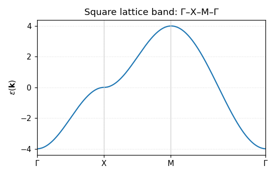
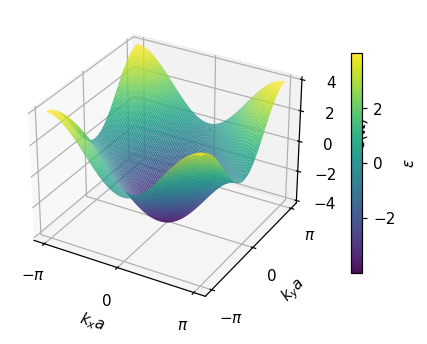

# 2次元正方格子のバンド分散

まず初めに、二次元正方格子のバンド分散についてまとめてみましょう。

強束縛模型のハミルトニアンを構築して、そこから**波数に対するエネルギー分散、\(\epsilon(k)\)**を求めてそれをプロットすることが目標になります。

## 0. ねらい

- 強束縛模型の**一般形**からスタートし、
- フーリエ変換で **\(k\)-空間ハミルトニアン**を導出、
- **2次元正方格子**に適用して**分散関係 \(\varepsilon(\mathbf{k})\)** を得る。

> 記法：格子定数 \(a\)、格子点位置 \(\mathbf{R}\)、運動量 \(\mathbf{k}\)、最近接ホッピング \(t\)、次近接 \(t'\)、第3近接 \(t''\)。

---

## 1. 一般化した強束縛模型（単一軌道・スピンなし）

実空間の二次量子化ハミルトニアン：

$$
\hat{H}= \sum_{\mathbf{R}} \epsilon_0\, \hat{c}^\dagger_{\mathbf{R}} \hat{c}_{\mathbf{R}}+ \sum_{\mathbf{R}}\sum_{\boldsymbol{\delta}} t(\boldsymbol{\delta})\,\hat{c}^\dagger_{\mathbf{R}} \hat{c}_{\mathbf{R}+\boldsymbol{\delta}}.
$$

ここでは、１サイトに１軌道しかないものとして扱う。多軌道・多サイトは別のタブで考える。
Rについての和は、全サイトで取るようにする。

- \(\hat{c}^\dagger_{\mathbf{R}}\)：サイト \(\mathbf{R}\) での生成演算子  
- \(\epsilon_0\)：オンサイトエネルギー  (そのサイトに電子が一つ存在するときのエネルギー)
- \(t(\boldsymbol{\delta})\)：相対ベクトル \(\boldsymbol{\delta}\) へのホッピング（距離に応じて \(t, t', t''\dots\)）

ハミルトニアンはエルミート演算子であることから、**エルミート性**より

\[
t(\boldsymbol{\delta}) = t^*(-\boldsymbol{\delta}).
\]

実パラメータを仮定すれば \(t(\boldsymbol{\delta}) = t(-\boldsymbol{\delta})\)。

---

## 2. フーリエ変換と \(\mathbf{k}\)-空間ハミルトニアン

ここでは実空間の二次量子化ハミルトニアンをフーリエ変換する。

\[
\hat{c}_{\mathbf{R}} = \frac{1}{\sqrt{N}}\sum_{\mathbf{k}} e^{i\mathbf{k}\cdot\mathbf{R}} \hat{c}_{\mathbf{k}},
\quad
\hat{c}^\dagger_{\mathbf{R}} = \frac{1}{\sqrt{N}}\sum_{\mathbf{k}} e^{-i\mathbf{k}\cdot\mathbf{R}} \hat{c}^\dagger_{\mathbf{k}}.
\]

これを実空間の二次量子化ハミルトニアンに代入する：

### (1) オンサイト項

\[
\sum_{\mathbf{R}} \epsilon_0\, \hat{c}^\dagger_{\mathbf{R}} \hat{c}_{\mathbf{R}}
= \frac{\epsilon_0}{N}\sum_{\mathbf{R}}\sum_{\mathbf{k},\mathbf{k}'}
e^{-i\mathbf{k}\cdot\mathbf{R}} e^{i\mathbf{k}'\cdot\mathbf{R}}
\hat{c}^\dagger_{\mathbf{k}}\hat{c}_{\mathbf{k}'}
= \epsilon_0\sum_{\mathbf{k}}\hat{c}^\dagger_{\mathbf{k}}\hat{c}_{\mathbf{k}}.
\]

（\(\sum_{\mathbf{R}} e^{i(\mathbf{k}'-\mathbf{k})\cdot\mathbf{R}} = N \delta_{\mathbf{k},\mathbf{k}'}\) を使用）

### (2) ホッピング項

\[
\sum_{\mathbf{R},\boldsymbol{\delta}} t(\boldsymbol{\delta})
\hat{c}^\dagger_{\mathbf{R}} \hat{c}_{\mathbf{R}+\boldsymbol{\delta}}
= \frac{1}{N}\sum_{\mathbf{R},\boldsymbol{\delta}} t(\boldsymbol{\delta})
\sum_{\mathbf{k},\mathbf{k}'}
e^{-i\mathbf{k}\cdot\mathbf{R}}
e^{i\mathbf{k}'\cdot(\mathbf{R}+\boldsymbol{\delta})}
\hat{c}^\dagger_{\mathbf{k}}\hat{c}_{\mathbf{k}'}.
\]

\[
= \frac{1}{N}\sum_{\boldsymbol{\delta}} t(\boldsymbol{\delta})
\sum_{\mathbf{k},\mathbf{k}'} e^{i\mathbf{k}'\cdot\boldsymbol{\delta}}
\left[\sum_{\mathbf{R}} e^{i(\mathbf{k}'-\mathbf{k})\cdot\mathbf{R}}\right]
\hat{c}^\dagger_{\mathbf{k}}\hat{c}_{\mathbf{k}'}
= \sum_{\mathbf{k}}\left[\sum_{\boldsymbol{\delta}} t(\boldsymbol{\delta}) e^{i\mathbf{k}\cdot\boldsymbol{\delta}}\right]
\hat{c}^\dagger_{\mathbf{k}}\hat{c}_{\mathbf{k}}.
\]

よって

\[
\hat{H}=\sum_{\mathbf{k}} \varepsilon(\mathbf{k})\,\hat{c}^\dagger_{\mathbf{k}}\hat{c}_{\mathbf{k}},
\quad
\boxed{\ \varepsilon(\mathbf{k})
= \epsilon_0 + \sum_{\boldsymbol{\delta}} t(\boldsymbol{\delta}) e^{i\mathbf{k}\cdot\boldsymbol{\delta}}.\ }
\]


> 直感：\(\varepsilon(\mathbf{k})\) は「全ホッピングの**位相和**」。  
> 対称性 \(t(\boldsymbol{\delta})=t(-\boldsymbol{\delta})\) を使うと
>
> \[
> \varepsilon(\mathbf{k}) = \epsilon_0 + 2\sum_{\boldsymbol{\delta}>0} t(\boldsymbol{\delta}) \cos(\mathbf{k}\cdot\boldsymbol{\delta}).
> \]

---

## 3. 2次元正方格子（square lattice）への適用

### 3.1 格子とブリルアンゾーン

- 実空間基底：\(\mathbf{a}_1=(a,0),\ \mathbf{a}_2=(0,a)\)  
- 逆格子基底：\(\mathbf{b}_1=\tfrac{2\pi}{a}(1,0),\ \mathbf{b}_2=\tfrac{2\pi}{a}(0,1)\)  （具体的な形がわからなくても、\(\mathbf{a}_i\cdot\mathbf{b}_j=2\pi i\delta_{ij}\)をわかっていればよい）
- 1次BZ：\(k_x, k_y \in [-\pi/a,\,\pi/a]\)

**最近接（NN）**の相対ベクトル：

\[
\boldsymbol{\delta}\in\{(\pm a,0),(0,\pm a)\}.
\]

これについても、実空間の基底に対して…と考えた方が応用が効いてよいと思われる。

### 3.2 近接の順に加える

#### (i) 最近接のみ（\(t\)）

\[
\varepsilon_{\text{NN}}(\mathbf{k})
= \epsilon_0 + t\big(e^{ik_x a}+e^{-ik_x a}+e^{ik_y a}+e^{-ik_y a}\big)
= \epsilon_0 + 2t\big(\cos k_x a + \cos k_y a\big).
\]

> 物性ではしばしば \(t>0\) と置き、バンドを \(-2t(\cos k_xa + \cos k_ya)\) と書く流儀もある。  
> **符号は定義（基底の位相やエネルギー原点）で変わり得る**ので、後の比較では一貫性を持たせること。

#### (ii) 次近接（\(t'\)）：斜め（対角）ホッピング

\[
\boldsymbol{\delta}\in\{(\pm a,\pm a)\}.
\]

\[
\sum_{\text{NNN}} e^{i\mathbf{k}\cdot\boldsymbol{\delta}}
= 2\cos(k_x a + k_y a)+2\cos(k_x a - k_y a)
= 4\cos k_x a \cos k_y a.
\]

\[
\Rightarrow\ \varepsilon_{\text{NNN}}(\mathbf{k})
= \varepsilon_{\text{NN}}(\mathbf{k}) + 4t' \cos k_x a \cos k_y a.
\]

#### (iii) 第3近接（\(t''\)）：直交2a

\[
\boldsymbol{\delta}\in\{(\pm 2a,0),(0,\pm 2a)\}.
\]

\[
\Rightarrow\ \varepsilon_{\text{3rd}}(\mathbf{k})
= \varepsilon_{\text{NNN}}(\mathbf{k}) + 2t''\big(\cos 2k_x a + \cos 2k_y a\big).
\]

### 3.3 まとめ（代表的な形）

$$ \boxed{\;\varepsilon(\mathbf{k})= \epsilon_0+ 2t\big(\cos k_x a + \cos k_y a\big)+ 4t'\cos k_x a \cos k_y a+ 2t''\big(\cos 2k_x a + \cos 2k_y a\big)+\cdots\;} $$

> しばしば \(\epsilon_0\) を吸収して **化学ポテンシャル** \(\mu\) を用い、\(\xi(\mathbf{k})=\varepsilon(\mathbf{k})-\mu\) と書く。

---

## 4. バンドの特徴（メモ）

- 最近接のみ：帯域幅 \(W=8|t|\)、頂点・谷は \(\Gamma=(0,0)\) と \((\pi/a,\pi/a)\)。  
- \(t'\) を入れると**電子–正孔非対称**が生じ、\((\pi/a,0)\)・\((0,\pi/a)\) 付近（\(\mathrm{M}\)点）で**鞍点（van Hove）**の位置やエネルギーがずれる。  
- \(t''\) はさらなる非対称性や曲率調整に効く。

### 4.1 実プロット（Γ–X–M–Γ）

下図は、上で導いた代表式に基づいて 2 次元正方格子のバンドを高対称線 \(\Gamma\to X\to M\to\Gamma\) でプロットした例です。



実行コードはこのページと同じディレクトリ配下に置きました（編集・再実行で図を更新できます）。

- スクリプト: [scripts/plot_band.py](scripts/plot_band.py)（GitHub: [harunao-negishi/mydocs › docs/research/square/scripts/plot_band.py](https://github.com/harunao-negishi/mydocs/blob/main/docs/research/square/scripts/plot_band.py)）
- 出力先: `figs/band_square.png`

パラメータ（\(t, t', t''\) など）はスクリプト冒頭の `CONFIG` で変更できます。Windows PowerShell からの実行例:

```powershell
# 仮想環境が自動選択される場合は、単に:
# python docs/research/square/scripts/plot_band.py

# 明示的に仮想環境の Python を使う場合（自動構成済み）
C:/Users/harut/Documents/mkdocs_projects/.venv/Scripts/python.exe docs/research/square/scripts/plot_band.py
```

### 4.2 3次元表示（ブリルアンゾーン上の表面）

分散 \(\varepsilon(\mathbf{k})\) を \(k_x\text{–}k_y\) 平面全体でサンプリングし，3D サーフェスとして可視化した例です。パラメータは 4.1 と同様に変更できます。



- スクリプト: [scripts/plot_band_3d.py](scripts/plot_band_3d.py)（GitHub: [harunao-negishi/mydocs › docs/research/square/scripts/plot_band_3d.py](https://github.com/harunao-negishi/mydocs/blob/main/docs/research/square/scripts/plot_band_3d.py)）
- 出力先: `figs/band_square_3d.png`

Windows PowerShell からの実行例:

```powershell
# 3D 図を生成
C:/Users/harut/Documents/mkdocs_projects/.venv/Scripts/python.exe docs/research/square/scripts/plot_band_3d.py
```

---

## 5. よくある拡張・注意

- **多軌道**：\(\hat{H}(\mathbf{k})\) は行列になり、固有値問題 \(\det|H(\mathbf{k})-E|=0\)。  
- **スピン**：スピン縮退やスピン–軌道相互作用（SOC）を入れるとブロックが増える。  
- **規格化**：フーリエ変換の \(1/\sqrt{N}\) などは全体で整合すればOK。  
- **符号規約**：文献間で \(t\) の符号や \(\epsilon_0\) の取り方が違うことがあるので比較時は注意。

---

## 6. 多軌道（多サイト）へ進むには

このページでは単一バンド（単一サイト・単一軌道）に焦点を当てました。複数サブ格子や多軌道を含む場合は、行列ハミルトニアン \(H(\mathbf{k})\) の固有値問題になります。詳しい導出（単位胞内位置の位相、A/B 二サイトの正方格子・ハニカムの具体例、固有ベクトルまで）は、別ページにまとめています。

- 解説と完全版の導出・例題: [multiband.md](multiband.md)

ポイントだけ抜粋すると：

- 多軌道（多サイト）では \(H_{\alpha\beta}(\mathbf k)\) は \(M\times M\) 行列。
- サブ格子間の“構造因子” \(\gamma(\mathbf k)\) が分散の形を決め、サブ格子ポテンシャル差 \(\Delta\) がギャップを与える。
- ゲージ（単位胞内位置の位相）の取り方で見かけは変わっても、物理量は不変。

以降は DOS（状態密度）や応用へ進みます。
