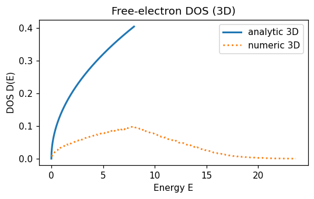
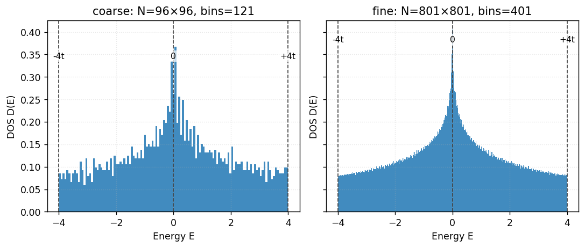

# 状態密度（DOS: Density of States）

本ページでは、正方格子に入る前に自由電子系（1/2/3 次元）の DOS を解析的に整理し、数値近似との比較プロットを用意します。その上で、最後に正方格子（強束縛）の DOS へ橋渡しします。

---

## 0. 定義と一般式（離散/連続）

バンド分散 \(\varepsilon(\mathbf{k})\) が与えられているとき、状態密度 \(D(E)\) は

$$
D(E) = \frac{1}{N} \sum_{\mathbf{k}} \delta\big(E - \varepsilon(\mathbf{k})\big),
$$

連続表現では（単位体積・面積・長さあたり）

$$
D(E) = \int_{\text{BZ}} \frac{d^d k}{(2\pi)^d} \, \delta\big(E - \varepsilon(\mathbf{k})\big),\qquad d=1,2,3.
$$

同時に、DOS は累積状態数（以下、累積DOS）

$$
N(E) := \int_{\text{BZ}} \frac{d^d k}{(2\pi)^d} \, \Theta\big(E - \varepsilon(\mathbf k)\big)
$$

のエネルギー微分としても定義できます：$D(E)=\frac{dN}{dE}$. 直感的には「$E$ 以下に存在する状態の総数」を数えてから微分する見方です。

---

### 0.1 積分範囲と規格化（わかりやすく）

- 連続（自由電子）: $k$ 空間は無限に広がるので、$\int d^d k$ は全空間での積分。$\delta(E-\varepsilon(\mathbf k))$ が“半径 $k_E$ の殻”に張り付け、体積積分が「殻の面積 $dS_E$ ÷ その上の速度 $|\nabla_k\varepsilon|$」に落ちます。
- 格子（強束縛）: $\varepsilon(\mathbf k)$ は逆格子で周期なので、積分は基本領域（第1ブリルアンゾーン）に限定して数えれば十分。正方格子なら $k_x,k_y\in[-\pi/a,\pi/a]$。
- 規格化: 上式の $(2\pi)^{-d}$ は「状態の密詰め間隔」。スピンなしならこのまま、スピンありなら 2 倍。図のヒストグラムは `density=True` で面積 1 に規格化された PDF（相対スケール）です。絶対値が必要なら単位系に応じて全体係数を掛けてください。

注）一次元で $N(E)$ の“長さ”が $2k_E$ になる、二次元で“円周”が $2\pi k_E$、三次元で“表面積”が $4\pi k_E^2$ になる……という幾何の対応関係が、そのまま $D(E)$ の $E$ 依存に反映されます。

## 1. 自由電子系の DOS（解析）

自由電子の分散は \(\varepsilon(\mathbf{k}) = \frac{\hbar^2 k^2}{2m}\)（スピン縮退なし）です。\(d\) 次元で一般に

$$
D_d(E) \propto E^{\tfrac{d}{2}-1} \quad (E>0),
$$

となり、具体的な（単位長さ/面積/体積あたり）の係数は

- 1D: \(\displaystyle D_{1\text{D}}(E) = \frac{1}{\pi}\sqrt{\frac{m}{2\hbar^2}}\,E^{-1/2}\,\Theta(E)\)
- 2D: \(\displaystyle D_{2\text{D}}(E) = \frac{m}{2\pi\hbar^2}\,\Theta(E)\)（定数）
- 3D: \(\displaystyle D_{3\text{D}}(E) = \frac{1}{2\pi^2}\Big(\frac{2m}{\hbar^2}\Big)^{3/2}\!\sqrt{E}\,\Theta(E)\)

ここで \(\Theta\) はヘヴィサイド関数。係数はスピン縮退を含めない（=1）取り方です（スピンを入れると全て 2 倍）。

補足：1 次元は累積状態数からの導出が分かりやすいです。自由電子では \(\varepsilon(k)=\hbar^2 k^2/2m\) で、\(E\ge 0\) に対して \(k_E=\sqrt{2mE}/\hbar\)。すると

- 累積状態数：\(\displaystyle N_{1\mathrm D}(E) = \frac{1}{2\pi}\int_{-k_E}^{k_E} dk = \frac{1}{\pi} k_E\)
- 微分：\(\displaystyle D_{1\mathrm D}(E) = \frac{dN}{dE} = \frac{1}{\pi}\frac{dk_E}{dE} = \frac{1}{\pi}\sqrt{\frac{m}{2\hbar^2}}\,E^{-1/2}\)

という具合に、低エネルギーでの発散 \(D\propto E^{-1/2}\) が自然に現れます。

---

## 2. プロット（解析式 vs 数値近似）

自由電子の DOS を、解析式と数値近似（\(\mathbf{k}\)-空間ランダムサンプリング→ヒストグラム）で重ね書きしました。

- 1D: \(D\propto E^{-1/2}\) で低エネルギー発散、2D: 定数、3D: \(D\propto \sqrt{E}\)。
- 数値近似はサンプル数を増やすほど解析曲線に収束（ビン幅・サンプル数の依存に注意）。

生成コードはこのページ配下：`scripts/dos_free_electron.py`（下記）。

---

## 2.5 物理的な見方：等エネルギー“面”と勾配

どの次元でも、定義

$$
D(E) = \int \frac{d^d k}{(2\pi)^d} \, \delta(E-\varepsilon(\mathbf k))
\quad\Rightarrow\quad
D(E) \propto \int_{\varepsilon(\mathbf k)=E} \frac{dS_E(\mathbf k)}{|\nabla_{\mathbf k}\varepsilon(\mathbf k)|}
$$

が鍵です（等エネルギー集合の“幾何”の大きさ ÷ その上での群速度）。自由電子 \(\varepsilon=\hbar^2 k^2/2m\) では \(|\nabla_k\varepsilon|=\hbar^2|k|/m\)。このとき

- 1D: 等エネルギー集合は 2 点（\(k=\pm k_E\)）。“面”の測度は定数、分母は \(|k|\sim k_E\propto \sqrt{E}\) → \(D\propto E^{-1/2}\)（低エネ発散）
- 2D: 等エネルギーは半径 \(k_E\) の円。長さ \(\propto k_E\)、分母 \(\propto k_E\) → 比は定数（\(E\)-独立）
- 3D: 等エネルギーは半径 \(k_E\) の球。面積 \(\propto k_E^2\)、分母 \(\propto k_E\) → \(D\propto k_E\propto \sqrt{E}\)

“幾何（等エネルギー集合のサイズ）÷ 速度”という見方は、格子バンドにもそのまま拡張できます（鞍点で速度が小さくなると DOS が大きくなる等）。

---

## 3. 正方格子（強束縛）DOS への橋渡し

2D 正方格子の最近接ホッピングのみの分散は

$$
\varepsilon(\mathbf{k})= -2t\,(\cos k_x + \cos k_y),
$$

で、DOS は**楕円積分**で解析的に書けます（スピンなし）

$$
\displaystyle D(E) = \frac{1}{2\pi^2 |t|}\,K\!\left(\sqrt{1 - \left(\frac{E}{4t}\right)^2}\,\right),\qquad |E|\le 4|t|,
$$

ここで \(K\) は第 1 種完全楕円積分。性質として

- バンド端 \(E\to\pm 4t\): \(K(0)=\pi/2\) なので \(D(E)\) は有限の定数に近づく（自由電子2Dの“定数”に通じるふるまい）
- 中心 \(E=0\): \(K(1)\to\infty\) で**対数発散**（van Hove 特異性）。等エネルギー線が鞍点（\(\mathrm M=(\pi,0),(0,\pi)\) 付近）を通るため、\(|\nabla\varepsilon|\to 0\) かつ曲率符号が混在し、測度/速度の比が対数発散になる。

“どこが定数っぽく、どこが発散か”を分散と見比べる観点：

- 端（\(\Gamma,(\pi,\pi)\) 近傍）では分散が放物線状（自由電子に近い）→ 2D らしい“ほぼ定数”へ
- 中心（\(E=0\) 付近）は鞍点が寄与 → **対数発散**

数値的には \(\mathbf{k}\) メッシュのエネルギーをヒストグラム化するのが簡単です（bin を細かくしすぎると統計ゆらぎが目立つので適度に）。

### 3.1 数値プロット（2D 正方格子 TB の DOS）

- ここでは「Nk による違い」が分かる比較図のみ掲載します（単独の滑らか図は省略）。粗いほどギザギザが目立ち、鞍点近傍の対数発散（\(E\approx 0\)）は丸まって見えます。

参考として、同じパラメータ系での高対称線バンド（Γ–X–M–Γ）の図も再掲します：

対応関係の見方（例：\(t>0\), \(\varepsilon=-2t(\cos k_x+\cos k_y)\)）

- 端の定数っぽさ: \(\Gamma\)（最小）と \((\pi,\pi)\)（最大）近傍は放物線 → DOS は端で有限（ほぼ一定）
- 中心の発散: \(\mathrm M=(\pi,0),(0,\pi)\) で鞍点 → \(E=0\) に**対数発散**（垂直線で示したエネルギー）

---

## 3.2 数値実装メモ（2D 正方格子の DOS）

ここで用いた数値 DOS の出し方を簡潔に：

- BZ 一様格子：\(k_x,k_y\in[-\pi/a,\pi/a]\) を \(N\times N\) 点で等間隔サンプリング（周期境界の 1 セル）。
- エネルギー列：各格子点で \(\varepsilon(\mathbf k)=-2t(\cos k_x+\cos k_y)\) を計算して 1 本の配列にまとめる。
- ヒストグラム：エネルギー範囲 \([-4t,4t]\) を \(\text{bins}\) 分割し、`density=True` でヒスト化（面積=1 に規格化された PDF）。
- 表示スケール：図は相対スケール（PDF）だが、絶対 DOS（単位面積あたり）が必要なら BZ 面積 \((2\pi/a)^2\) と \((2\pi)^{-2}\) を掛けて合わせる（単位系の選択に依存）。
- 解像度依存：\(N\) が小さい/\(\text{bins}\) が細かいほどギザギザ（統計ゆらぎ）が目立ち、van Hove 近傍はブロード化。\(N\) と \(\text{bins}\) はバランス良く増やす。
- オプション：回転/反転対称性を使った第 1 ブリルアンゾーンの 1/8 領域のみのサンプリング（重み付け）や、ガウシアンブロードニングでの“平滑化”も有効。
