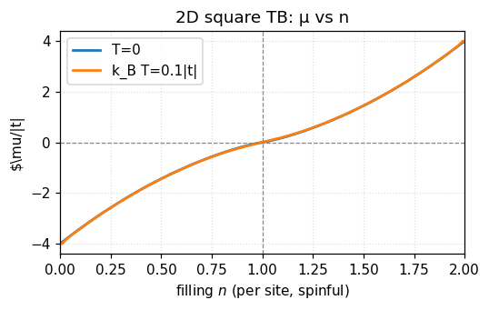
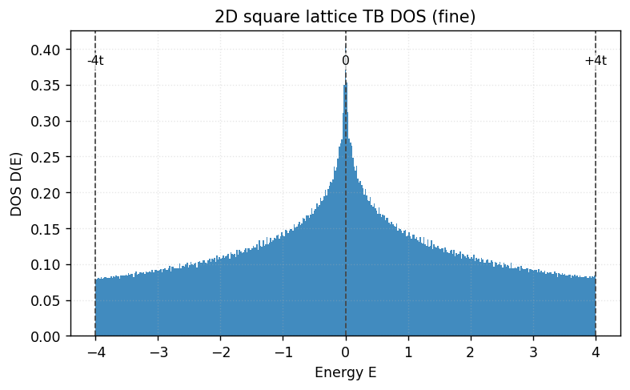
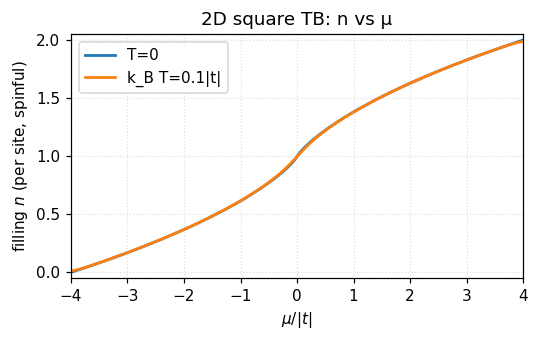

# フィリングと化学ポテンシャル（Filling–μ）

本ページでは、化学ポテンシャル \(\mu\)、フェルミエネルギー \(E_F\) の意味と、DOS（状態密度）からフィリング \(n\) をどう計算するか、さらに目標 \(n\) から \(\mu\) をどう決めるかを、正方格子（強束縛）を例に整理します。

---

## 0. 用語と直感

- 化学ポテンシャル \(\mu\): “粒子を 1 個出し入れしたときのエネルギー的な傾き”。有限温度では分布関数 \(f(E,\mu,T) = 1/(e^{(E-\mu)/k_B T}+1)\) の中心位置。
- フェルミエネルギー \(E_F\): 絶対零度 \(T\to 0\) における \(\mu\) の極限。固体ではしばしば「占有の境界」を示す基準エネルギー。
- フィリング（充填率） \(n\): 1 格子サイトあたりの電子数。スピン縮退を含む場合は \(0\le n\le 2\)（1 軌道/サイト）。スピンなし（理論上の簡略化）なら \(0\le n\le 1\)。

ポイント：\(T=0\) では分布がステップ関数になり、“\(\mu=E_F\) まで詰める”という単純な絵に還元されます。

---

## 1. 一般式：DOS からフィリングを求める

スピン縮退 \(g_s\)（通常 2）を明示して

$$
\boxed{\quad n(\mu, T) = g_s \int_{-\infty}^{\infty} D(E) \, f(E,\mu,T)\, dE \quad}
$$

- \(D(E)\): 単位サイトあたりの DOS（エネルギー当たりの状態数）。
- \(f(E,\mu,T)\): フェルミ–ディラック分布。
- スピンありなら \(g_s=2\)、スピンなしなら \(g_s=1\)。

特に \(T=0\) では \(f\to \Theta(\mu-E)\) なので

$$
\boxed{\quad n(\mu,0) = g_s \int_{-\infty}^{\mu} D(E)\, dE = g_s\, N(\mu)\quad}
$$

ここで \(N(E)=\int_{-\infty}^E D(\varepsilon)\, d\varepsilon\) は累積状態数です。したがって、目標 \(n\) に対して \(\mu\) は \(N(\mu)=n/g_s\) を満たすように選べばよい（単調な区間なら二分法で容易）。

> 規格化の約束（n と N のスケール）
>
> - 本ページでは \(D(E)\) を「1 サイト・1 スピンあたり」の DOS とします。すると \(\displaystyle \int_{-\infty}^{\infty} D(E)\,dE = m_{\mathrm{orb}}\)（1 サイトに \(m_{\mathrm{orb}}\) 本の独立バンド＝軌道がある）。
> - このとき累積 \(N(E)=\int^E D\,dE\) は区間 \([0,\, m_{\mathrm{orb}}]\) に入ります。スピンありのフィリングは \(\boxed{\,n(\mu,0)=g_s\,N(\mu)\,}\) で、範囲は \(0\le n\le g_s\,m_{\mathrm{orb}}\)。
> - もし \(D(E)\) に最初からスピンを含める（=2 倍する）流儀を採るなら、式は \(n(\mu,0)=\int^\mu D(E)\,dE\) と書けばよく、余計な \(g_s\) は掛けません。どちらか一方に統一してください。
> - 本レポの数値図で用いるヒストグラムは `density=True` により面積 1 の PDF（1 スピン・1 バンド相当）に規格化しています。複数軌道なら面積を \(m_{\mathrm{orb}}\) に、スピンありならさらに \(g_s\) を掛ければ、絶対スケールの \(n\) に一致します。

---

## 2. 格子（離散バンド）での書き方

BZ（第 1 ブリルアンゾーン）の和で書くと

$$
 n(\mu,T) = \frac{g_s}{N_k} \sum_{\mathbf k} f\big(\varepsilon(\mathbf k),\mu,T\big),
$$

- \(N_k\) はサンプルした \(\mathbf k\) 点の総数（単位サイト換算）。
- DOS を経由せず、直接 \(\mathbf k\) 積分（和）で評価してもよい。
- \(T=0\) では、\(\varepsilon(\mathbf k)\le \mu\) を満たす格子点の“割合”に等しい（スピンありなら 2 倍）。

---

## 3. 2D 正方格子（最近接ホッピング）の特徴

分散を

$$
\varepsilon(\mathbf k) = -2t(\cos k_x + \cos k_y),\qquad t>0
$$

とすると DOS は \(E=0\)（M 点の鞍点）で対数発散、\(E=\pm 4t\) で有限。対称性から \(T=0\) の半充填（\(n=g_s/2\)）では \(\mu=0\)。有限温度では van Hove 近傍の急峻さが和らぎ、\(n(\mu,T)\) は滑らかになります。

### 3.1 \(\mu\)–\(n\) の関係（主図）

充填率 \(n\) を横軸、化学ポテンシャル \(\mu\) を縦軸にした曲線です（スピンあり \(g_s=2\); \(k_B T=0\) と \(0.1|t|\)）。



見るポイント：

- 2D 最近接 TB は粒子–正孔対称なので、半充填 \(n=g_s/2\) で \(\mu=0\)。すなわち \(n<g_s/2\) では \(\mu<0\)、\(n>g_s/2\) では \(\mu>0\)。
- 0 温度では \(\dfrac{dn}{d\mu}=g_s D(\mu)\) なので、傾き \(\dfrac{d\mu}{dn}=1/(g_s D(\mu))\)。van Hove（\(\mu\approx 0\) で \(D\) が大）では曲線が“寝る”（\(\mu\) が動きにくい＝ピン留めされる）。
- 有限温度ではこの特徴がなめらかにされ、ゼロ交差はおおむね保たれる。

対応する DOS（ヒストグラム）の形も併せて見ると理解しやすいです：



---

## 4. 実務：\(n\) から \(\mu\) を決める（アルゴリズム）

- T=0（累積からの逆写像）
  - 手順: 累積 \(N(E)=\int^E D\,dE\) を数値化 → 単調区間で \(N(\mu)=n/g_s\) を二分法で解く。
  - 注意: van Hove 近傍は数値ノイズに敏感。エネルギー刻みとブロードニングを適度に。
- T>0（単調性を使った 1 次元根探し）
  - 手順: \(F(\mu)=g_s\int D(E) f(E,\mu,T) dE - n\) を定義 → \(F(\mu)=0\) を二分法/ニュートンで解く。
  - メモ: \(n(\mu,T)\) は \(\mu\) に対して単調増加なので、区間さえ与えれば収束は容易。

DOS ではなく \(\mathbf k\) 和で直接やる場合は、\(E(\mathbf k)\) 配列を一度作っておき、\(\mu\) を振って \(\langle f(E(\mathbf k),\mu,T)\rangle_{\mathbf k}\) を評価するのが実装簡単です。

---

## 5. コード分解：\(n\to\mu\) はどう計算している？

以下は、実装の要所だけを抽出したものです（実際の全体は [scripts/filling_mu_tb.py](scripts/filling_mu_tb.py) を参照）。

1. \(\mathbf k\) 格子と分散の配列化

```python
# kx, ky in [-pi, pi] (a=1) and energy array Ek
a = 1.0; t = 1.0; Nk = 601
kx = np.linspace(-np.pi, np.pi, Nk)
ky = np.linspace(-np.pi, np.pi, Nk)
KX, KY = np.meshgrid(kx, ky, indexing="xy")
Ek = -2.0 * t * (np.cos(KX) + np.cos(KY))
Ek = Ek.ravel()
```

2. \(n(\mu)\) の評価関数（\(T=0\) ならステップ関数）

```python
def fermi(E, mu, kBT):
  if kBT == 0.0:
    return (E < mu).astype(float)
  x = np.clip((E - mu) / (kBT + 1e-15), -50.0, 50.0)
  return 1.0 / (np.exp(x) + 1.0)

def n_of_mu(Ek, mu, kBT, gs):
  return float(gs * fermi(Ek, mu, kBT).mean())
```

3. \(n\to\mu\) への“反転”

- \(T=0\): \(n = g_s\,\text{frac}(E\le \mu)\) なので、\(\mu\) はエネルギー分布の分位点（quantile）で直接求まる。

```python
Ek_sorted = np.sort(Ek)
p = np.clip(n_target / gs, 0.0, 1.0)
mu_star = np.quantile(Ek_sorted, p)
```

- \(T>0\): まず \(\mu\) 軸上に密な格子を取り、\(n(\mu)\) を一括計算 → 単調性を使って 1 次元補間で反転。

```python
mu_grid = np.linspace(mu_min, mu_max, 1201)
n_mu = np.array([n_of_mu(Ek, mu, kBT, gs) for mu in mu_grid])
n_mu = np.maximum.accumulate(n_mu)  # 数値ノイズでの非単調を抑制
mu_star = np.interp(n_target, n_mu, mu_grid)
```

この方法は、（1） bisection を多数回回すより高速、（2）図のための曲線全体を滑らかに生成できる、という利点があります。

---

## 6. 実装メモ（本レポの設定）

- スピン: 既定で \(g_s=2\)（結果を 2 倍）。
- 単位: \(t=1\) を基準に無次元化。エネルギーは \(E/t\)、温度は \(k_B T/t\)。
- 積分: \(k_x,k_y\in[-\pi,\pi]\) を一様格子でサンプリング（第 1 BZ）。
- 精度: \(N\times N\) メッシュで \(N=400\sim 800\) 程度、必要ならガウシアンブロードニングで DOS 平滑化。

スクリプト: [scripts/filling_mu_tb.py](scripts/filling_mu_tb.py)

---

### 付記：逆向きの関係（\(\mu\) を変えたときの \(n(\mu)\)）

主図とは逆向きに、\(\mu\) を横軸、\(n\) を縦軸にした曲線も参考までに（T=0 と有限温度）。



---

### 付記：フェルミエネルギーの“意味”をもう一歩

- 平衡で粒子数が保存される系において、\(\mu\) は「粒子数の拘束」をラグランジュ乗数で表したもの。\(T\to 0\) で \(E_F\) に一致し、配列の“切れ目”を定める。
- バンドが複数ある場合は全バンドの DOS の和で同様に扱う（ギャップがあればその分 \(n(\mu)\) は平坦になる）。
- 近傍で DOS が急峻（van Hove）だと、微小な \(\mu\) 変化でも \(n\) が大きく動く → ドーピング制御や熱的応答に影響。
