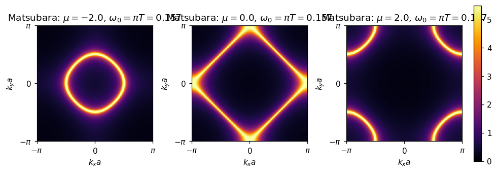

# 非相互作用グリーン関数 G0 の可視化（2D 正方格子）

ここでは、2D 正方格子 tight-binding の分散関係

\[
\varepsilon(\mathbf{k}) = -2t\,[\cos k_x + \cos k_y]\quad (a=1)
\]

に対する非相互作用グリーン関数 \(G_0\) を運動量空間で可視化します。フェルミ面の形状が \(|G_0|\) のヒートマップで自ずと強調されることを、化学ポテンシャル \(\mu\) を変えながら確認します。

## 定義と観点（Matsubara のみ）

- Matsubara グリーン関数（周波数を \(\mu\) からの相対で測るのが通例）

\[
G_0(\mathbf{k}, i\omega_n) = \frac{1}{i\omega_n - (\varepsilon(\mathbf{k})-\mu)}\,.
\]

最低のフェルミ周波数 \(\omega_0=\pi T\) では
\(|G_0| = 1/\sqrt{\omega_0^2 + (\varepsilon(\mathbf{k})-\mu)^2}\) となり、\(\varepsilon(\mathbf{k})\approx\mu\) の帯で強くなります。

（本ページでは Matsubara 形式のみ扱います。）

## ヒートマップ（|G0|）とフェルミ面

下図は \(t=1\), \(a=1\), 格子数 \(N_k=401\) の BZ グリッド上で計算した Matsubara 版 \(|G_0(\mathbf{k}, i\omega_0)|\)（\(\omega_0=\pi T\), \(T=0.05\)） のヒートマップです。\(\mu\in\{-2,0,+2\}\) を比較しています。

読み取りのポイント:

- \(\mu=-2\): \(\varepsilon(\mathbf{k})=-2\) の等高線は \(\Gamma\) 点（中心）周りに閉曲線をつくります。
- \(\mu=0\): 正方格子 TB の半充填に相当し、ダイアモンド形（\((\pm\pi,0),(0,\pm\pi)\) を結ぶ）フェルミ線が現れます。
- \(\mu=+2\): \(M(\pi,\pi)\) 周りに閉曲線が移動します。

いずれも、\(|G_0|\) の強い帯（明るい等高線）がフェルミ面（2D ではフェルミ「線」）をなぞります。

### 再現方法（スクリプト）

- スクリプト: `research/square/scripts/green_g0_heatmap.py`
- 出力図: `research/square/figs/`

パラメータ（既定値）は `Nk=401`, `eta=0.05`, `T=0.05`, `mu_list=[-2,0,2]` です。`mu_list` や `eta`, `T` を変更すると、バンドや温度幅に応じてフェルミ線の見え方が変わります。

補足: 数値表示ではごく少数の画素が極端に明るくならないよう、カラー上限を分位点（98%）でクリップしています。フェルミ線の形そのもの（等高線の位置）は影響を受けません。

