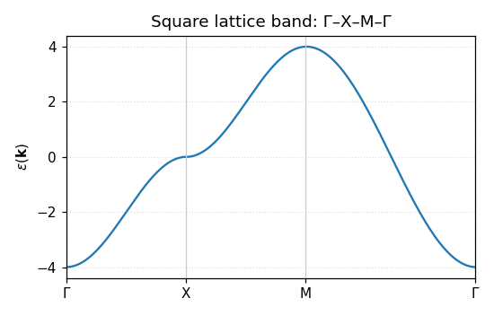
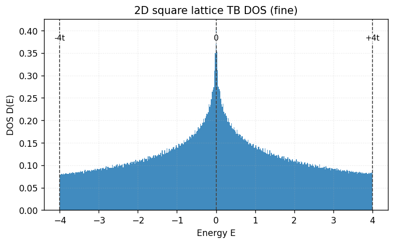

# 2D 正方格子の数値実装パイプライン（復習）

このページでは、2D 正方格子（最近接ホッピング）を題材に、数値実装の全体像を「コードを見ながら」復習できるようまとめます。

1. フーリエ変換と（一般の）対角化の流れ
2. バンド作成・プロット（Γ–X–M–Γ）
3. DOS の作成・プロット（BZ 一様格子 → ヒストグラム）
4. DOS（または k 和）から n–μ の作成・プロット

---

## 0. ゴールと前提

- 模型: 2D 正方格子、最近接ホッピングのみ（スピンは縮退として g_s で扱う）
- 分散: \(\varepsilon(\mathbf k)=-2t(\cos k_x+\cos k_y)\)（\(t>0\)）
- 単位系: \(|t|=1\) で無次元化（図の凡例に \(\mu/|t|\)、\(k_B T/|t|\) などと表記）
- 既存スクリプト（scripts フォルダ）を活用し、必要な箇所は抜粋して解説

---

## 1. フーリエ変換と対角化（一般形）

実空間の TB ハミルトニアン（1 サイト 1 軌道を想定）

\[
H=\sum_{i} \epsilon_0\,c_i^\dagger c_i - t\sum_{\langle i,j\rangle} c_i^\dagger c_j + \text{h.c.}
\]

をフーリエ変換してブロッホ表現に移すと、1 軌道の場合はスカラーな \(\varepsilon(\mathbf k)\) に落ちます：

\[
\varepsilon(\mathbf k) = \epsilon_0 -2t(\cos k_x+\cos k_y).
\]

多軌道（行列）なら \(H(\mathbf k)\) を組んで \(\mathrm{eigvalsh}\) などで固有値を求めます。1 軌道なら「対角化」は不要で、関数の評価のみです。

Python の一般形スケッチ：

```python
import numpy as np

def Hk_square_1orb(kx, ky, t=1.0, eps0=0.0):
    return eps0 - 2.0*t*(np.cos(kx) + np.cos(ky))  # scalar

# 多軌道例スケッチ（2×2 行列のイメージ）
# def Hk_square_2orb(kx, ky, params):
#     H = np.zeros((2,2), dtype=float)
#     # 対角・非対角要素を k 依存で埋める
#     return H  # np.linalg.eigvalsh(H) で固有値
```

---

## 2. バンド作成・プロット（Γ–X–M–Γ）

既存: `scripts/plot_band.py`（画像: `figs/band_square.png`）。核となる処理は「高対称線の k パス生成 → \(\varepsilon(\mathbf k)\) 評価 → プロット」です。

抜粋（読みやすく簡略）：

```python
# k パス Γ→X→M→Γ を作ってエネルギーを描く
kx, ky, x, xticks, xticklabels = kpath_G_X_M_G(a=1.0, nk=200)
ek = Hk_square_1orb(kx, ky, t=1.0, eps0=0.0)
# x（累積距離）を横軸に ek を描く
```



3D の表面表示（参考）: `figs/band_square_3d.png`（`scripts/plot_band_3d.py`）

---

## 3. DOS の作成・プロット

既存: `scripts/dos_square_tb.py`（画像: `figs/dos_square_tb.png`／比較図 `figs/dos_square_tb_mesh_compare.png`）。

- BZ 一様格子（\(k_x,k_y\in[-\pi,\pi]\)）を \(N\times N\) 点サンプル
- 各点で \(\varepsilon(\mathbf k)\) を評価して 1 本の配列にまとめる
- エネルギー範囲を bins 分割してヒストグラム（`density=True` で PDF 規格化）

抜粋：

```python
kx = np.linspace(-np.pi, np.pi, N)
ky = np.linspace(-np.pi, np.pi, N)
KX, KY = np.meshgrid(kx, ky, indexing="xy")
E = Hk_square_1orb(KX, KY, t=1.0, eps0=0.0).ravel()
hist, edges = np.histogram(E, bins=401, density=True)
```



粗い vs 細かいメッシュの比較（統計ゆらぎと van Hove 近傍の丸まり方の違い）：


---

## 4. DOS（または k 和）から n–μ を作る

基本式（スピン縮退 \(g_s\) を別管理）

\[
n(\mu,T)=\frac{g_s}{N_k}\sum_{\mathbf k} f(\varepsilon(\mathbf k),\mu,T)
\quad\text{または}\quad
n(\mu,T)=g_s\int D(E) f(E,\mu,T)\,dE.
\]

既存: `scripts/filling_mu_tb.py`。

- n(μ) は \(\langle f(E(\mathbf k),\mu,T)\rangle\) で OK
- μ(n) は T=0 なら分位点（quantile）、有限 T は μ グリッド上の n(μ) を計算→単調補間で反転

結果図：

- 主図（μ–n）: `figs/mu_vs_filling_tb.png`
- 参考（n–μ）: `figs/filling_mu_tb.png`


---

## 5. 実行の流れ（最短ルート）

- バンド: `scripts/plot_band.py` → `figs/band_square.png`
- DOS: `scripts/dos_square_tb.py` → `figs/dos_square_tb.png`（＋比較図）
- 充填率と μ: `scripts/filling_mu_tb.py` → `figs/mu_vs_filling_tb.png`, `figs/filling_mu_tb.png`

VS Code のターミナルはこのリポジトリの仮想環境（.venv）を使う設定にしてあります。新しく開いたターミナルでそのまま実行すれば、上記の画像が生成されます。

---

### 参考リンク

- バンド分散（概念・図）: `research/square/band.md`
- DOS（定義・図・数値実装メモ）: `research/square/dos.md`
- 充填率と化学ポテンシャル: `research/square/filling_mu.md`
