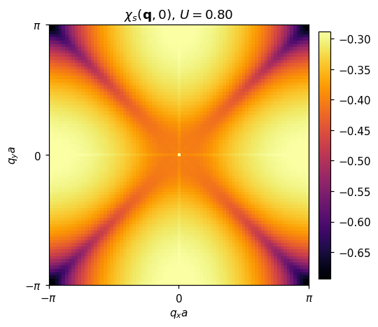
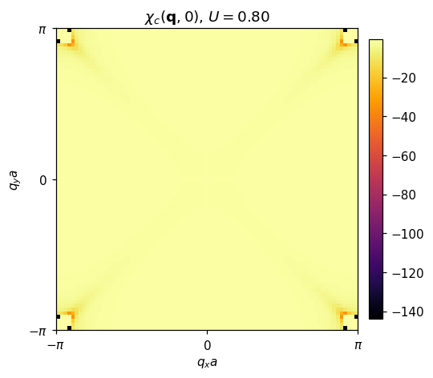
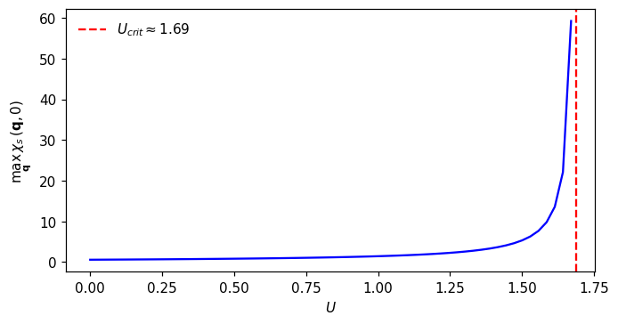
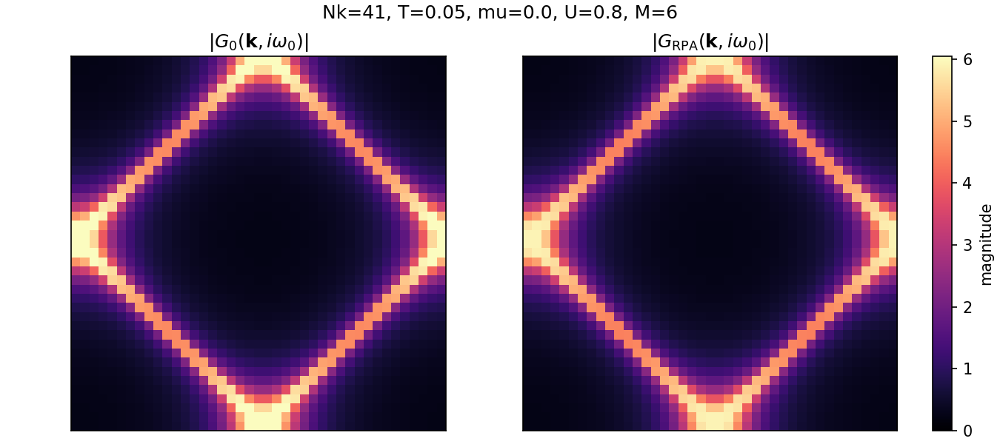

# RPA（2D 正方格子 TB）: 電荷・スピン感受率と簡易 Σ による G の比較

本ページでは、前ページで得た非相互作用感受率 \(\chi_0\)（静的, Matsubara）を用いて、ハバード相互作用 \(U\) に対する RPA の電荷・スピン感受率

\[
\chi_s(\mathbf{q},0) = \frac{\chi_0(\mathbf{q},0)}{1 - U\,\chi_0(\mathbf{q},0)}\,,\qquad
\chi_c(\mathbf{q},0) = \frac{\chi_0(\mathbf{q},0)}{1 + U\,\chi_0(\mathbf{q},0)}
\]

を可視化します。さらに、RPA に基づく簡便な「静的・局所」自己エネルギー \(\Sigma\) を仮定した \(G\) と非相互作用 \(G_0\) の比較図を示します（定性的な違いの把握を目的としたトイモデル）。

前提: \(t=1\), \(a=1\), \(\mu=0\)（半充填）, \(T=0.05\), \(N_k=81\)。

## RPA 感受率（静的）

- スピン感受率（\(\chi_s\)）



- 電荷感受率（\(\chi_c\)）



半充填の正方格子 TB では、\(\chi_0\) は \(\mathbf{Q}=(\pi,\pi)\) 付近で大きく、\(U>0\) に対してスピンチャネル \(\chi_s\) が強く増幅されます。一方、電荷チャネル \(\chi_c\) は分母が \(1+U\chi_0\) となるため抑制されます。

### 臨界相互作用 \(U_{crit}\)

RPA スピン感受率は \(1 - U\,\chi_0(\mathbf{q}^*,0) = 0\) で発散します。よって

\[
U_{crit} = \frac{1}{\max_{\mathbf{q}} \chi_0(\mathbf{q},0)}
\]

が目安です。本設定では \(U_{crit}\approx 1.69\) 程度（数値出力より）で、\(U<U_{crit}\) の範囲に留めると物理量が安定に評価できます。

下図は \(\max_{\mathbf{q}}\chi_s(\mathbf{q},0)\) の \(U\) 依存を示し、\(U\to U_{crit}\) で急激に増大する様子を示します。



## RPA 有効相互作用にもとづく \(\Sigma\) による \(G\) の比較（最低松原）

有効相互作用 \(V(\mathbf{q}, i\Omega_m) = \tfrac{3}{2}U^2\chi_s + \tfrac{1}{2}U^2\chi_c - U^2\chi_0\) を用いて、
一次（非自己無撞着）近似で Matsubara の自己エネルギーを

\[
\Sigma(\mathbf{k}, i\omega_n) = \frac{T}{N_k}\sum_{\mathbf{q},m} V(\mathbf{q}, i\Omega_m)\,G_0\bigl(\mathbf{k}-\mathbf{q}, i\omega_n-i\Omega_m\bigr)
\]

として評価し、最低フェルミ松原 \(i\omega_0\) における \(|G_{\mathrm{RPA}}(\mathbf{k}, i\omega_0)|\) と \(|G_0(\mathbf{k}, i\omega_0)|\) を比較します（\(G_0\) を内部に用いた一発評価）。



ここではボーズ松原 \(m=0,1,\dots,M\) を有限個取り（対称性から \(\pm m\) をまとめて寄与）、\(\mathbf{q}\)-和は 2 次元の循環畳み込みとして高速フーリエ変換で評価しています。静的・局所近似とは異なり、動的な \(V\) による（Matsubara 軸上の）周波数依存を含みますが、自己無撞着化（\(G\) を用いた再評価）は行っていません。

## スクリプトと再現（やること一覧）

- research/square/scripts/rpa_square_tb.py
  - 目的: 静的 \(\chi_0(\mathbf{q},0)\) から \(\chi_s,\chi_c\) を作り、発散目安 \(U_{crit}\) を見積もる。静的の可視化を出力
  - 主な出力:
    - `chi_s_static_heatmap.png`（スピン感受率の静的マップ）
    - `chi_c_static_heatmap.png`（電荷感受率の静的マップ）
    - `chi_s_Uscan.png`（\(\max_\mathbf{q}\chi_s\) の U 依存）
    - 以前の「静的・局所 Σ による G 比較」図は削除済み

- research/square/scripts/rpa_selfenergy_realaxis_toy.py
  - 目的: 実周波数で \(Q=(\pi,\pi)\) 成分のみを用いたトイモデルとして、\(V^R\)→\(\Sigma^R\)→スペクトル幅の発生を確認
  - 使う式: \(V^R(Q,\Omega)=\tfrac{3}{2}U^2\chi_s^R+\tfrac{1}{2}U^2\chi_c^R-U^2\chi_0^R\)（最後の項はダブルカウント補正）
  - 主な出力:
    - `A_kF_rpa_vs_nonint.png`（スペクトル関数の比較）
    - `imSigma_kF.png`（\(\mathrm{Im}\,\Sigma^R\)）

- research/square/scripts/rpa_sigma_matsubara.py
  - 目的: Matsubara 軸で \(\chi_0(\mathbf{q}, i\Omega_m)\) を構成→ \(\chi_s,\chi_c\) → \(V(\mathbf{q}, i\Omega_m)\) → 一発 \(\Sigma(\mathbf{k}, i\omega_0)\) を計算し、\(|G_0|\) と \(|G_{\mathrm{RPA}}|\)（最低松原）を比較
  - 主な出力:
    - `g0_vs_grpa_matsubara_rpaSigma.png`

### クイック実行（任意）

以下は Windows PowerShell 用の実行例です。仮想環境は `mydocs/.venv` を想定しています。

```powershell
# 1) 静的 RPA（χs, χc, Ucrit など）
C:/Users/harut/Documents/mkdocs_projects/.venv/Scripts/python.exe mydocs/docs/research/square/scripts/rpa_square_tb.py

# 2) Matsubara 軸の Σ で |G0| vs |GRPA|（最低松原）
C:/Users/harut/Documents/mkdocs_projects/.venv/Scripts/python.exe mydocs/docs/research/square/scripts/rpa_sigma_matsubara.py

# 3) （任意）実周波数のトイ Σ^R（Q 成分のみ）
C:/Users/harut/Documents/mkdocs_projects/.venv/Scripts/python.exe mydocs/docs/research/square/scripts/rpa_selfenergy_realaxis_toy.py

# 4) サイト再ビルド
cd mydocs; mkdocs build; cd ..
```

典型パラメータ（スクリプト先頭で調整可能）: `Nk=41`、`T=0.05`、`mu=0.0`、`U=0.8 (< Ucrit)`、ボーズ松原 `M=6`。

> 注意: ここでの実周波数 Σ は「支配的な \(Q=(\pi,\pi)\) 成分のみ」「一回の Dyson での一発評価」というトイモデルです。定性的な「\(\mathrm{Im}\,\Sigma^R\) による幅の発生」を見る目的の簡易版として用いています（厳密には \(q\)-依存・自己無撞着化・動的フィードバックが必要）。

## 有効相互作用と自己エネルギー（式のまとめ）

- 有効相互作用（スピン・電荷揺らぎ媒介、RPA）：

  $$
  V(\mathbf{q}, i\Omega_m) = \tfrac{3}{2}U^2\,\chi_s(\mathbf{q}, i\Omega_m) + \tfrac{1}{2}U^2\,\chi_c(\mathbf{q}, i\Omega_m) - U^2\,\chi_0(\mathbf{q}, i\Omega_m)\,.
  $$

  第3項はダブルカウント補正（同じバブルの重複を 1 回差し引く）。

- 自己エネルギー（Matsubara）：

  $$
  \Sigma(\mathbf{k}, i\omega_n)
  = \frac{T}{N_k}\sum_{\mathbf{q},m} V(\mathbf{q}, i\Omega_m)\,G\bigl(\mathbf{k}-\mathbf{q}, i\omega_n-i\Omega_m\bigr)\,.
  $$

実周波数での図示では、上式の畳み込みを簡略化した近似式を用いて \(\Sigma^R\) を評価し、
\(A(\mathbf{k}_F,\omega)=-\tfrac{1}{\pi}\,\mathrm{Im}\,G^R\) の幅が \(\mathrm{Im}\,\Sigma^R\) により増す様子を可視化しています。

## U の適切な範囲について（議論）

- 静的 RPA のスピンチャネルは \(U\to U_{crit}^-\) で強く増幅し、\(U\ge U_{crit}\) で発散（スピン秩序のしきい値の目安）
- したがって、数値上の安定・比較のためには \(U\ll U_{crit}\)（例えば \(U \lesssim 0.5\,U_{crit}\)）から様子を見て、必要に応じて \(U/U_{crit}\) をパラメータとして議論するのが実務的
- 実系を念頭に置く場合や、動的効果や自己無撞着性が重要な場合は、RPA を出発点として FLEX や DMFT などのより高次の近似・数値手法での検証を推奨

本ページは、\(\chi_0\) → RPA 増幅 → 目安 \(U_{crit}\) → それが \(G\) の見え方に与える定性的影響、の流れを簡潔に確認することを目的としています。
