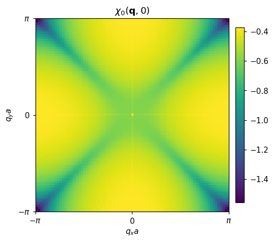
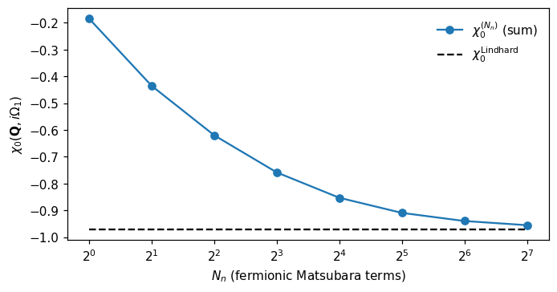
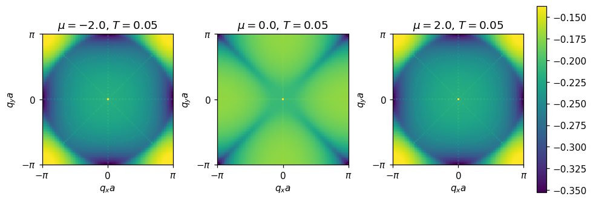
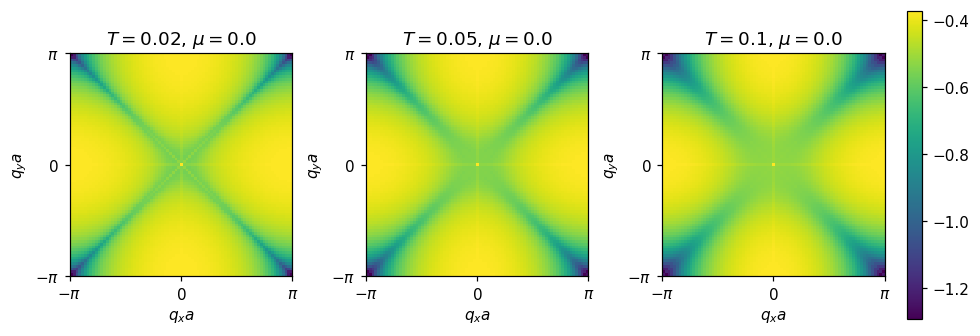

# 非相互作用の感受率 \(\chi_0\)（2D 正方格子, Matsubara）

2D 正方格子 tight-binding

\[
\varepsilon(\mathbf{k}) = -2t\,[\cos k_x + \cos k_y]\quad (a=1)
\]

に対する（スピン縮退 \(g_s=2\)）非相互作用感受率 \(\chi_0\) を Matsubara 軸で計算・可視化します。

## 定義（Matsubara 和の後）

密度・スピンいずれの「バブル」でも、非相互作用の一次感受率は

\[
\chi_0(\mathbf{q}, i\Omega_m)
= \frac{g_s}{N_k}\, T \sum_{\mathbf{k},n}
G_0(\mathbf{k}, i\omega_n)\, G_0(\mathbf{k}+\mathbf{q}, i\omega_n + i\Omega_m)
\]

の形で与えられ、\(\omega_n\) 和を行うと（Lindhard 形式）

\[
\chi_0(\mathbf{q}, i\Omega_m)
= \frac{g_s}{N_k}\sum_{\mathbf{k}}
\frac{ f(\varepsilon_{\mathbf{k}}-\mu) - f(\varepsilon_{\mathbf{k}+\mathbf{q}}-\mu) }
{ i\Omega_m - (\varepsilon_{\mathbf{k}+\mathbf{q}} - \varepsilon_{\mathbf{k}}) }\,.
\]

- ボソン周波数の最低は \(m=0\)（\(i\Omega_0=0\)）です。静的極限では、\(\Delta E \equiv \varepsilon_{\mathbf{k}+\mathbf{q}} - \varepsilon_{\mathbf{k}} = 0\) となる点で被積分子を極限値 \(-\partial f/\partial E\) に置き換えると滑らかに定義できます（本リポジトリの実装もこの処理を採用）。

本ページでは \(t=1\), \(a=1\), \(\mu=0\)（半充填）, \(T=0.05\), \(N_k=81\) を既定に用います。

## 結果：ヒートマップ（静的のみ；最低ボソン松原 \(m=0\)）

- 静的（\(m=0\)）

読み取りのポイント：半充填ではネスティングにより \(\mathbf{Q}=(\pi,\pi)\) 付近で \(\chi_0\) が大きくなります（四角格子 TB の代表的特徴）。

## Matsubara 周波数の種類

- フェルミオン（内部和の周波数）: \(\omega_n = (2n+1)\pi T\), \(n\in\mathbb{Z}\)
- ボソン（外部周波数）: \(\Omega_m = 2m\pi T\), \(m\in\mathbb{Z}\)

本ページでは、外部はボソン周波数 \(i\Omega_m\) を用い、内部はフェルミオン周波数 \(i\omega_n\) で和をとります。

## Lindhard 形式への収束の確認（\(\mathbf{Q}=(\pi,\pi)\), 最低ボソン松原）

有限個のフェルミオン松原和で評価した

\[
\chi_0^{(N_n)}(\mathbf{q}, i\Omega_m)
= \frac{g_s}{N_k}\,T\sum_{\mathbf{k}}\sum_{n=-N_n}^{N_n}
G_0(\mathbf{k}, i\omega_n)\,G_0(\mathbf{k}+\mathbf{q}, i\omega_n+i\Omega_m)
\]

が、\(N_n\to\infty\) で Lindhard 形式

\[
\chi_0^{\rm Lindhard}(\mathbf{q}, i\Omega_m)
= \frac{g_s}{N_k}\sum_{\mathbf{k}}
\frac{ f(\varepsilon_{\mathbf{k}}-\mu) - f(\varepsilon_{\mathbf{k}+\mathbf{q}}-\mu) }
{ i\Omega_m - (\varepsilon_{\mathbf{k}+\mathbf{q}} - \varepsilon_{\mathbf{k}}) }
\]

に収束することを、\(\mathbf{q}=\mathbf{Q}=(\pi,\pi)\), \(m=1\)（最低ボソン松原）で確認します。

横軸は和の打ち切り \(N_n\)、縦軸は \(\chi_0^{(N_n)}\)（点）と \(\chi_0^{\rm Lindhard}\)（破線）です。\(N_n\) を増やすと両者が一致していく様子がわかります。

## μ・T 依存（Lindhard 形式，静的）

- μ を変化（\(T=0.05\) 固定）

（例）\(\mu=-2,0,+2\) と変えると、FS の位置・形状の変化に伴い \(\chi_0(\mathbf{q},0)\) のピーク位置と強度が変わります。半充填近傍では \((\pi,\pi)\) のピークが強く、ドーピングで緩和します。

- T を変化（\(\mu=0\) 固定）

温度を上げると Fermi エッジが丸くなり、\(\chi_0\) のピークがブロードになっていく（鋭さが減る）様子がわかります。

## 再現方法（スクリプト）

- スクリプト: `research/square/scripts/chi0_square_tb.py`
- 出力図: `research/square/figs/`

安定化のため、静的極限では \(|\Delta E|\) が非常に小さい格子点で被積分子を極限値 \(-\partial f/\partial E\) に置き換えています。また、ヒートマップは 98% 分位でカラーバー上限をクリップして外れ値の影響を抑えています。

- μ/T 依存の図は `research/square/scripts/chi0_lindhard_sweeps.py` で生成できます（出力: `chi0_static_mu_grid.png`, `chi0_static_T_grid.png`）。
